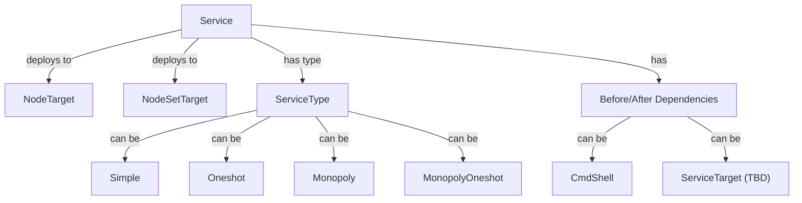

# Service as a Service API



## Overview

The Service resource provides a REST-based API for creating and managing systemd services across compute nodes. It enables declarative service management with support for different service types, dependencies, and lifecycle management.

## Core Components

- `Service`: The main service entity that defines a systemd service configuration
- `ServiceType`: Defines the service behavior (simple, oneshot, monopoly, monopoly_oneshot)
- `Target`: Specifies where to deploy the service (node or node_set)
- `Before/After`: Dependencies that run before or after the service (shell commands or other services)
- `ServiceNode`: The actual deployed service instance on a specific node

### Service

The main service entity that manages:
- **Status**: NEW, IN_PROGRESS, ACTIVE, ERROR
- **Target Status**: enabled, disabled
- **Name**: Service identifier (alphanumeric, underscores, hyphens)
- **Path**: The command or script to execute
- **User/Group**: Execution context (defaults to root)

### Service Types

| Type | Description | Use Case |
|------|-------------|----------|
| `simple` | Regular service with configurable instance count | Long-running services like web servers |
| `oneshot` | One-time execution service | Initialization scripts, migrations |
| `monopoly` | Only one instance across all nodes | Singleton services like schedulers |
| `monopoly_oneshot` | One-time execution, only one instance | One-time initialization tasks |

### Target Types

- `node`: Deploy service to a specific compute node
- `node_set`: Deploy service to all nodes in a node set

### Dependencies

Services can define dependencies that run before or after the main service:

- **CmdShell**: Execute a shell command
  - `command`: The shell command to execute
- **ServiceTarget** (TBD): Reference another service for ordering (currently disabled, service relationships are being reworked)

## API Structure

### Creating a Service

#### Simple Service

```json
{
  "name": "my-web-server",
  "description": "Production web server",
  "path": "/usr/local/bin/start-web-server.sh",
  "user": "www-data",
  "group": "www-data",
  "target": {
    "kind": "node",
    "node": "12345678-c625-4fee-81d5-f691897b8142"
  },
  "service_type": {
    "kind": "simple",
    "count": 2
  },
  "target_status": "enabled",
  "before": [],
  "after": []
}
```

#### Oneshot Service

```json
{
  "name": "db-migration",
  "description": "Database migration script",
  "path": "/usr/local/bin/migrate-db.sh",
  "user": "root",
  "target": {
    "kind": "node_set",
    "node_set": "abcdef12-3456-7890-abcd-ef1234567890"
  },
  "service_type": {
    "kind": "oneshot"
  },
  "target_status": "enabled",
  "before": [
    {
      "kind": "shell",
      "command": "echo 'Starting migration...'"
    }
  ],
  "after": [
    {
      "kind": "shell",
      "command": "echo 'Migration complete'"
    }
  ]
}
```

#### Monopoly Service

```json
{
  "name": "scheduler",
  "description": "Global scheduler service",
  "path": "/usr/local/bin/scheduler",
  "user": "scheduler",
  "group": "scheduler",
  "target": {
    "kind": "node_set",
    "node_set": "abcdef12-3456-7890-abcd-ef1234567890"
  },
  "service_type": {
    "kind": "monopoly",
    "count": 1
  },
  "target_status": "enabled",
  "before": [],
  "after": []
}
```

#### Service with Shell Dependencies

```json
{
  "name": "app-with-deps",
  "description": "Application with pre/post commands",
  "path": "/opt/app/start.sh",
  "user": "appuser",
  "target": {
    "kind": "node",
    "node": "12345678-c625-4fee-81d5-f691897b8142"
  },
  "service_type": {
    "kind": "simple",
    "count": 1
  },
  "target_status": "enabled",
  "before": [
    {
      "kind": "shell",
      "command": "mkdir -p /var/log/app && chown appuser:appuser /var/log/app"
    }
  ],
  "after": [
    {
      "kind": "shell",
      "command": "curl -X POST http://monitoring/notify/service-up"
    }
  ]
}
```

### Service with Service Dependencies (TBD)

```json
{
  "name": "dependent-service",
  "description": "Service that depends on another service",
  "path": "/opt/app/dependent-start.sh",
  "user": "appuser",
  "target": {
    "kind": "node",
    "node": "12345678-c625-4fee-81d5-f691897b8142"
  },
  "service_type": {
    "kind": "simple",
    "count": 1
  },
  "target_status": "enabled",
  "before": [
    {
      "kind": "service",
      "service": "abcdef12-3456-7890-abcd-ef1234567890",
      "service_name": "base-service"
    }
  ],
  "after": []
}
```

## Validation Rules

### Service Name Validation
- Must match regex `^[A-Za-z0-9_-]{0,100}$`
- Alphanumeric characters, underscores, and hyphens only
- Maximum 100 characters

### Path Validation
- Required field
- Minimum 1 character, maximum 255 characters
- Should be an absolute path to executable

### Target Validation
- Must specify either `node` or `node_set` target
- Target node/node_set must exist

### Service Type Validation
- Must be one of: `simple`, `oneshot`, `monopoly`, `monopoly_oneshot`
- `simple` and `monopoly` types support `count` parameter
- `monopoly` types enforce count=1 across all nodes

### Dependency Validation
- `before` and `after` are required arrays (can be empty)
- Each dependency must have a valid `kind`: `shell` or `service`
- Shell dependencies require a `command` field
- Service dependencies require `service` (UUID) and `service_name` fields

## Dataplane Behavior

When a Service is created, the system:

1. Creates a systemd service file at `/etc/systemd/system/genesis_srv_<name>_<uuid>.service`
2. Runs `systemctl daemon-reload`
3. Enables and starts the service if `target_status` is `enabled`
4. Disables the service if `target_status` is `disabled`

### Systemd Service Template

The generated systemd service file follows this template:

```ini
[Unit]
Description=Genesis Core: dynamic service {name}
After=network.target

[Service]
Type={simple|oneshot}
Restart={always|on-failure}
ExecStart=/usr/bin/bash -c '{command}'
User={user}
Group={group}
ExecStartPre=+/usr/bin/bash -c '{before_command}'
ExecStartPost=+/usr/bin/bash -c '{after_command}'
RestartSec=5s
TimeoutStopSec=30

[Install]
WantedBy=multi-user.target
```

## Status Lifecycle

```
NEW → IN_PROGRESS → ACTIVE
  ↓
ERROR
```

- **NEW**: Service record created, not yet processed
- **IN_PROGRESS**: Service is being deployed to target nodes
- **ACTIVE**: All ServiceNode instances are active
- **ERROR**: Deployment failed (check logs for details)

## Element Manifest Example

Basic manifest for creating a service:

```yaml
requirements:
  core:
    from_version: "0.0.0"

imports:
  core_compute_node:
    element: "$core"
    kind: "resource"
    link: "$core.compute.nodes.$my_node"

resources:
  $core.em.services:
    my_service:
      project_id: "12345678-c625-4fee-81d5-f691897b8142"
      name: "my-app-service"
      path: "/opt/myapp/start.sh"
      user: "appuser"
      group: "appuser"
      target:
        kind: "node"
        node: "$core.compute.nodes.$my_node:uuid"
      service_type:
        kind: "simple"
        count: 1
      target_status: "enabled"
      before:
        - kind: "shell"
          command: "mkdir -p /var/log/myapp"
      after: []
```

### Complex Example with Node Set

```yaml
requirements:
  core:
    from_version: "0.0.0"

imports:
  core_compute_nodeset:
    element: "$core"
    kind: "resource"
    link: "$core.compute.sets.$my_nodeset"

resources:
  $core.em.services:
    monopoly_scheduler:
      project_id: "12345678-c625-4fee-81d5-f691897b8142"
      name: "scheduler"
      path: "/usr/local/bin/scheduler --config /etc/scheduler.conf"
      user: "scheduler"
      group: "scheduler"
      target:
        kind: "node_set"
        node_set: "$core.compute.sets.$my_nodeset:uuid"
      service_type:
        kind: "monopoly"
        count: 1
      target_status: "enabled"
      before:
        - kind: "shell"
          command: "/usr/local/bin/wait-for-db.sh"
      after:
        - kind: "shell"
          command: "echo 'Scheduler started on $(hostname)'"
```

## API Endpoints

| Method | Endpoint | Description |
|--------|----------|-------------|
| GET | `/v1/em/services/` | List all services |
| POST | `/v1/em/services/` | Create a new service |
| GET | `/v1/em/services/<uuid>` | Get service details |
| PUT | `/v1/em/services/<uuid>` | Update service |
| DELETE | `/v1/em/services/<uuid>` | Delete service |

## Permissions

The Service resource uses the following IAM policies:
- **Service**: `em.service`

Available actions:
- `create`: Create new services
- `read`: View service details
- `update`: Modify existing services
- `delete`: Remove services
- `list`: List all services
