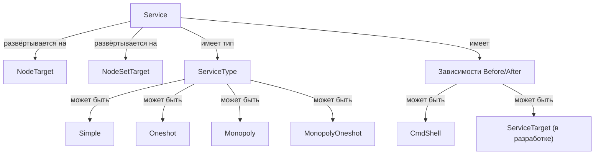

# API Service as a Service



## Обзор

Ресурс Service предоставляет REST API для создания и управления сервисами systemd на вычислительных узлах. Он обеспечивает декларативное управление сервисами с поддержкой различных типов сервисов, зависимостей и управления жизненным циклом.

## Основные компоненты

- `Service`: Основная сущность сервиса, определяющая конфигурацию systemd сервиса
- `ServiceType`: Определяет поведение сервиса (simple, oneshot, monopoly, monopoly_oneshot)
- `Target`: Указывает, где развернуть сервис (node или node_set)
- `Before/After`: Зависимости, которые запускаются до или после сервиса (команды shell или другие сервисы)
- `ServiceNode`: Фактический развёрнутый экземпляр сервиса на конкретном узле

### Service

Основная сущность сервиса, управляющая:

- **Статусом**: NEW, IN_PROGRESS, ACTIVE, ERROR
- **Целевым статусом**: enabled, disabled
- **Имя**: Идентификатор сервиса (буквенно-цифровые символы, подчёркивания, дефисы)
- **Path**: Команда или скрипт для выполнения
- **User/Group**: Контекст выполнения (по умолчанию root)

### Типы сервисов

| Тип               | Описание                                      | Сценарий использования                               |
|-------------------|-----------------------------------------------|------------------------------------------------------|
| `simple`          | Обычный сервис с настраиваемым количеством экземпляров | Долго работающие сервисы, например веб-серверы      |
| `oneshot`         | Сервис однократного выполнения                  | Скрипты инициализации, миграции                      |
| `monopoly`        | Только один экземпляр на всех узлах           | Синглтон сервисы, например планировщики             |
| `monopoly_oneshot`| Однократное выполнение, только один экземпляр | Одноразовые задачи инициализации                     |

### Типы целевых объектов

- `node`: Развернуть сервис на конкретном вычислительном узле
- `node_set`: Развернуть сервис на всех узлах в наборе узлов

### Зависимости

Сервисы могут определять зависимости, которые запускаются до или после основного сервиса:

- **CmdShell**: Выполнение команды shell
    - `command`: Команда shell для выполнения
- **ServiceTarget** (в разработке): Ссылка на другой сервис для упорядочивания (в данный момент отключено, отношения сервисов перерабатываются)

## Структура API

### Создание сервиса

#### Простой сервис

```json
{
  "name": "my-web-server",
  "description": "Production web server",
  "path": "/usr/local/bin/start-web-server.sh",
  "user": "www-data",
  "group": "www-data",
  "target": {
    "kind": "node",
    "node": "12345678-c625-4fee-81d5-f691897b8142"
  },
  "service_type": {
    "kind": "simple",
    "count": 2
  },
  "target_status": "enabled",
  "before": [],
  "after": []
}
```

#### Oneshot сервис

```json
{
  "name": "db-migration",
  "description": "Скрипт миграции базы данных",
  "path": "/usr/local/bin/migrate-db.sh",
  "user": "root",
  "target": {
    "kind": "node_set",
    "node_set": "abcdef12-3456-7890-abcd-ef1234567890"
  },
  "service_type": {
    "kind": "oneshot"
  },
  "target_status": "enabled",
  "before": [
    {
      "kind": "shell",
      "command": "echo 'Starting migration...'"
    }
  ],
  "after": [
    {
      "kind": "shell",
      "command": "echo 'Migration complete'"
    }
  ]
}
```

#### Monopoly сервис

```json
{
  "name": "scheduler",
  "description": "Глобальный сервис-планировщик",
  "path": "/usr/local/bin/scheduler",
  "user": "scheduler",
  "group": "scheduler",
  "target": {
    "kind": "node_set",
    "node_set": "abcdef12-3456-7890-abcd-ef1234567890"
  },
  "service_type": {
    "kind": "monopoly",
    "count": 1
  },
  "target_status": "enabled",
  "before": [],
  "after": []
}
```

#### Сервис с shell-зависимостями

```json
{
  "name": "app-with-deps",
  "description": "Приложение с pre/post командами",
  "path": "/opt/app/start.sh",
  "user": "appuser",
  "target": {
    "kind": "node",
    "node": "12345678-c625-4fee-81d5-f691897b8142"
  },
  "service_type": {
    "kind": "simple",
    "count": 1
  },
  "target_status": "enabled",
  "before": [
    {
      "kind": "shell",
      "command": "mkdir -p /var/log/app && chown appuser:appuser /var/log/app"
    }
  ],
  "after": [
    {
      "kind": "shell",
      "command": "curl -X POST http://monitoring/notify/service-up"
    }
  ]
}
```

### Сервис с зависимостями от других сервисов (в разработке)

```json
{
  "name": "dependent-service",
  "description": "Сервис, зависящий от другого сервиса",
  "path": "/opt/app/dependent-start.sh",
  "user": "appuser",
  "target": {
    "kind": "node",
    "node": "12345678-c625-4fee-81d5-f691897b8142"
  },
  "service_type": {
    "kind": "simple",
    "count": 1
  },
  "target_status": "enabled",
  "before": [
    {
      "kind": "service",
      "service": "abcdef12-3456-7890-abcd-ef1234567890",
      "service_name": "base-service"
    }
  ],
  "after": []
}
```

## Правила валидации

### Валидация имени сервиса

- Должно соответствовать регулярному выражению `^[A-Za-z0-9_-]{0,100}$`
- Только буквенно-цифровые символы, подчёркивания и дефисы
- Максимум 100 символов

### Валидация пути

- Обязательное поле
- Минимум 1 символ, максимум 255 символов
- Должен быть абсолютным путём к исполняемому файлу

### Валидация целевого объекта

- Должен быть указан либо `node`, либо `node_set` target
- Целевой узел/набор узлов должен существовать

### Валидация типа сервиса

- Должен быть одним из: `simple`, `oneshot`, `monopoly`, `monopoly_oneshot`
- Типы `simple` и `monopoly` поддерживают параметр `count`
- Типы `monopoly` требуют count=1 на всех узлах

### Валидация зависимостей

- `before` и `after` — обязательные массивы (могут быть пустыми)
- Каждая зависимость должна иметь корректный `kind`: `shell` или `service`
- Shell-зависимости требуют поля `command`
- Зависимости от сервисов требуют полей `service` (UUID) и `service_name`

## Поведение Dataplane

При создании сервиса система:

1. Создаёт файл сервиса systemd по пути `/etc/systemd/system/ec_<name>_<uuid>.service`
2. Запускает `systemctl daemon-reload`
3. Включает и запускает сервис, если `target_status` равен `enabled`
4. Отключает сервис, если `target_status` равен `disabled`

### Шаблон сервиса Systemd

Сгенерированный файл сервиса systemd следует этому шаблону:

```ini
[Unit]
Description=Exordos Core: dynamic service {name}
After=network.target

[Service]
Type={simple|oneshot}
Restart={always|on-failure}
ExecStart=/usr/bin/bash -c '{command}'
User={user}
Group={group}
ExecStartPre=+/usr/bin/bash -c '{before_command}'
ExecStartPost=+/usr/bin/bash -c '{after_command}'
RestartSec=5s
TimeoutStopSec=30

[Install]
WantedBy=multi-user.target
```

## Жизненный цикл статусов

```text
NEW → IN_PROGRESS → ACTIVE
  ↓
ERROR
```

- **NEW**: Запись сервиса создана, ещё не обработана
- **IN_PROGRESS**: Сервис развёртывается на целевых узлах
- **ACTIVE**: Все экземпляры ServiceNode активны
- **ERROR**: Развёртывание не удалось (смотрите логи для подробностей)

## Пример манифеста элемента

Базовый манифест для создания сервиса:

```yaml
requirements:
  core:
    from_version: "0.0.0"

imports:
  core_compute_node:
    element: "$core"
    kind: "resource"
    link: "$core.compute.nodes.$my_node"

resources:
  $core.em.services:
    my_service:
      project_id: "12345678-c625-4fee-81d5-f691897b8142"
      name: "my-app-service"
      path: "/opt/myapp/start.sh"
      user: "appuser"
      group: "appuser"
      target:
        kind: "node"
        node: "$core.compute.nodes.$my_node:uuid"
      service_type:
        kind: "simple"
        count: 1
      target_status: "enabled"
      before:
        - kind: "shell"
          command: "mkdir -p /var/log/myapp"
      after: []
```

### Сложный пример с набором узлов

```yaml
requirements:
  core:
    from_version: "0.0.0"

imports:
  core_compute_nodeset:
    element: "$core"
    kind: "resource"
    link: "$core.compute.sets.$my_nodeset"

resources:
  $core.em.services:
    monopoly_scheduler:
      project_id: "12345678-c625-4fee-81d5-f691897b8142"
      name: "scheduler"
      path: "/usr/local/bin/scheduler --config /etc/scheduler.conf"
      user: "scheduler"
      group: "scheduler"
      target:
        kind: "node_set"
        node_set: "$core.compute.sets.$my_nodeset:uuid"
      service_type:
        kind: "monopoly"
        count: 1
      target_status: "enabled"
      before:
        - kind: "shell"
          command: "/usr/local/bin/wait-for-db.sh"
      after:
        - kind: "shell"
          command: "echo 'Scheduler started on $(hostname)'"
```

## Конечные точки API

| Метод | Конечная точка             | Описание             |
|-------|----------------------------|----------------------|
| GET   | `/v1/em/services/`         | Список всех сервисов |
| POST  | `/v1/em/services/`         | Создать новый сервис |
| GET   | `/v1/em/services/<uuid>`   | Получить детали сервиса |
| PUT   | `/v1/em/services/<uuid>`   | Обновить сервис    |
| DELETE| `/v1/em/services/<uuid>`   | Удалить сервис     |

## Разрешения

Ресурс Service использует следующие IAM политики:

- **Service**: `em.service`

Доступные действия:

- `create`: Создание новых сервисов
- `read`: Просмотр деталей сервиса
- `update`: Изменение существующих сервисов
- `delete`: Удаление сервисов
- `list`: Список всех сервисов
