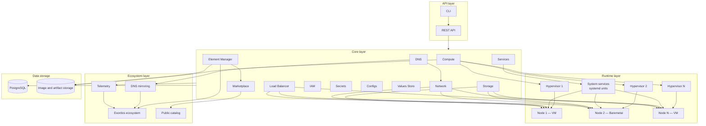
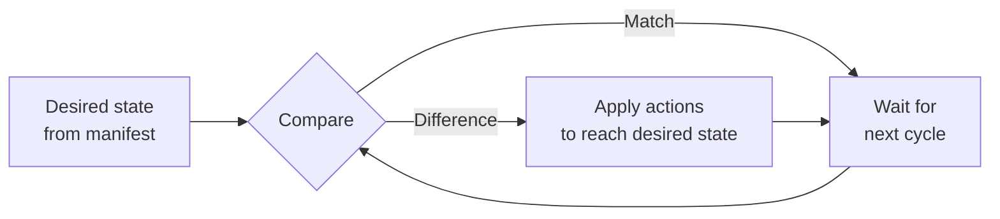

# Exordos Core Architecture

<!--
Copyright 2026 Genesis Corporation JSC

Licensed under the Apache License, Version 2.0 (the "License");
you may not use this file except in compliance with the License.
You may obtain a copy of the License at

    http://www.apache.org/licenses/LICENSE-2.0

Unless required by applicable law or agreed to in writing, software
distributed under the License is distributed on an "AS IS" BASIS,
WITHOUT WARRANTIES OR CONDITIONS OF ANY KIND, either express or implied.
See the License for the specific language governing permissions and
limitations under the License.
-->

## 1. General architecture description

Exordos Core is a software platform for automating the deployment, management, and operation of IT infrastructure and enterprise software. The platform is built on the principle of declarative management with continuous reconciliation of the desired state (reconciliation loop).

The architecture consists of four layers:

1. **API layer** — REST API for managing all platform resources.
2. **Core layer** — components that manage compute resources, storage, network, access, configurations, and the element lifecycle.
3. **Runtime layer** — hypervisors and compute nodes that run workloads.
4. **Ecosystem layer** — interaction between the stand and the external ecosystem (DNS mirroring, telemetry, element catalogs).

## 2. Main components

| Component | Purpose |
| --------- | ------- |
| **Compute** | Creation and management of compute nodes: virtual machines and physical servers |
| **Storage** | Creation and management of disk volumes attached to compute nodes |
| **Network** | Creation and management of network resources |
| **DNS** | Creation and management of DNS resources |
| **Load Balancer** | Creation and management of load balancers |
| **IAM** | Management of users, roles, and access permissions |
| **Secrets** | Storage and delivery of secrets, keys, and certificates |
| **Configs** | Storage and delivery of configurations to software components |
| **Services** | Management of system services (systemd units) on compute nodes |
| **Values Store** | Management of values, variables, and parameterization profiles |
| **Element Manager** | Installation, update, and lifecycle management of elements |
| **Marketplace** | Public and private element catalogs |

## 3. Architecture diagram

## 4. Data flows and interactions

### 4.1. Resource management

1. A user or external system submits a manifest describing the desired state of a resource to the REST API.
2. The platform core persists the desired state in the database (PostgreSQL).
3. The relevant component (Compute, Storage, Network, etc.) compares the desired state with the actual state.
4. On a difference, the component performs the actions required to bring the actual state to the desired one (create, update, or delete the resource).
5. The reconciliation loop runs continuously, keeping the desired state in place.

### 4.2. Compute node management

1. The Compute component talks to the hypervisor to create, update, or delete virtual machines.
2. The lifecycle of virtual machines and physical servers (bare metal) does not differ: both use image-based provisioning, in which the root disk is replaced with the contents of the target image.
3. During an update, attached data volumes and network identities are preserved.
4. The Services component manages system services (systemd units) on compute nodes.

### 4.3. Element management

1. Element Manager receives a command to install an element from a catalog (Marketplace).
2. Dependencies between elements are checked and resolved.
3. The infrastructure resources required by the element (compute nodes, volumes, networks) are created.
4. Configurations, values, and secrets are delivered to the element.
5. The new requirements, resources, imports, and exports declared in the manifest are applied.
6. An element can extend the platform with new REST resource types.

### 4.4. Ecosystem interaction

1. The stand registers with the ecosystem using its realm credentials (realm UUID and realm secret).
2. DNS records from domains marked for ecosystem synchronization are regularly mirrored to the ecosystem.
3. Telemetry (counts of nodes, hypervisors, installed elements, users, and other resources) is sent to the ecosystem when telemetry is enabled and ecosystem credentials are configured; it can be disabled for isolated stands.
4. The public element catalog is available through the ecosystem for discovery and installation.

## 5. Reconciliation loop

The reconciliation loop is the core architectural mechanism of Exordos Core. All system components operate in a continuous verification mode:

1. The desired state is described in manifests and stored in the database.
2. The component compares the desired state with the actual state of the managed resource.
3. On a difference, the component performs actions to bring the actual state to the desired one.
4. On a match, the component waits for the next verification cycle.
5. The loop repeats continuously for all resources.

## 6. Deployment options

Exordos Core is used in local, private, public, and hybrid environments:

- **Local environment** — a single-host installation where the host machine acts as the hypervisor; intended for development and testing.
- **Private environment** — an isolated environment on customer-owned hardware or in an isolated cloud VPC, including air-gapped deployments; used when regulatory and compliance requirements apply.
- **Public environment** — deployment in a public cloud, including the managed Exordos cloud operated by the provider.
- **Hybrid environment** — combining private infrastructure and cloud resources under a single platform control plane.

## Next steps

- [Platform Overview](platform-overview.md)
- [Functional Characteristics](functional-characteristics.md)
- [Admin Guide](admin-guide.md)
- [Manifest Reference](../em/manifest.md)
