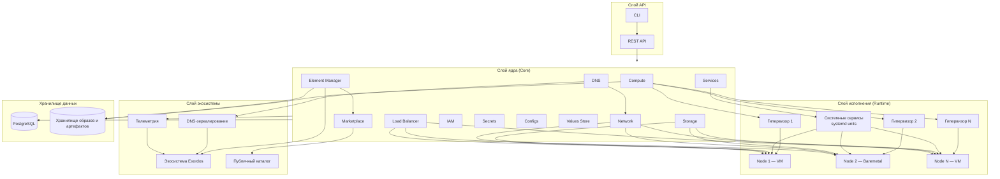
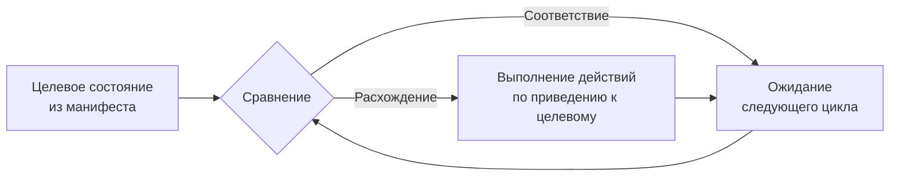

# Архитектура Exordos Core

<!--
Copyright 2026 Genesis Corporation JSC

Licensed under the Apache License, Version 2.0 (the "License");
you may not use this file except in compliance with the License.
You may obtain a copy of the License at

    http://www.apache.org/licenses/LICENSE-2.0

Unless required by applicable law or agreed to in writing, software
distributed under the License is distributed on an "AS IS" BASIS,
WITHOUT WARRANTIES OR CONDITIONS OF ANY KIND, either express or implied.
See the License for the specific language governing permissions and
limitations under the License.
-->

## 1. Общее описание архитектуры

Exordos — программная платформа для автоматизации развёртывания, управления и эксплуатации IT-инфраструктуры и корпоративного программного обеспечения. Платформа построена по принципу декларативного управления с непрерывным поддержанием целевого состояния (reconciliation loop).

Архитектура состоит из четырёх слоёв:

1. **Слой API** — REST API для управления всеми ресурсами платформы.
2. **Слой ядра (Core)** — компоненты, обеспечивающие управление вычислительными ресурсами, хранилищами, сетью, доступом, конфигурациями и жизненным циклом элементов.
3. **Слой исполнения (Runtime)** — гипервизоры и вычислительные узлы, на которых запускаются полезные нагрузки.
4. **Слой экосистемы** — взаимодействие стенда с внешней экосистемой (DNS-зеркалирование, телеметрия, каталоги элементов).

## 2. Основные компоненты

| Компонент | Назначение |
| --------- | ---------- |
| **Compute** | Создание и управление вычислительными узлами: виртуальными машинами и физическими серверами |
| **Storage** | Создание и управление дисковыми томами, подключаемыми к вычислительным узлам |
| **Network** | Создание и управление сетевыми ресурсами |
| **DNS** | Создание и управление DNS-ресурсами |
| **Load Balancer** | Создание и управление балансировщиками нагрузки |
| **IAM** | Управление пользователями, ролями и правами доступа |
| **Secrets** | Хранение и предоставление секретов, ключей и сертификатов |
| **Configs** | Хранение и предоставление конфигураций программным компонентам |
| **Services** | Управление системными сервисами (systemd units) на вычислительных узлах |
| **Values Store** | Управление значениями, переменными и профилями параметризации |
| **Element Manager** | Установка, обновление и управление жизненным циклом элементов |
| **Marketplace** | Публичные и приватные каталоги элементов |

## 3. Диаграмма архитектуры

## 4. Потоки данных и взаимодействия

### 4.1. Управление ресурсами

1. Пользователь или внешняя система обращается к REST API с манифестом, описывающим целевое состояние ресурса.
2. Ядро платформы сохраняет целевое состояние в базе данных (PostgreSQL).
3. Соответствующий компонент (Compute, Storage, Network и т. д.) сравнивает целевое состояние с фактическим.
4. При расхождении компонент выполняет действия по приведению фактического состояния к целевому (создание, обновление, удаление ресурса).
5. Цикл согласования (reconciliation loop) выполняется непрерывно, обеспечивая поддержание целевого состояния.

### 4.2. Управление вычислительными узлами

1. Компонент Compute обращается к гипервизору для создания, обновления или удаления виртуальных машин.
2. Жизненный цикл виртуальных машин и физических серверов (baremetal) не отличается: в обоих случаях используется образ-ориентированное развёртывание, при котором корневой диск заменяется содержимым целевого образа.
3. При обновлении подключённые тома данных и сетевые идентификаторы сохраняются.
4. Компонент Services управляет системными сервисами (systemd units) на вычислительных узлах.

### 4.3. Управление элементами

1. Element Manager получает команду на установку элемента из каталога (Marketplace).
2. Проверяются и разрешаются зависимости между элементами.
3. Создаются инфраструктурные ресурсы, требуемые элементом (вычислительные узлы, тома, сети).
4. Элементу передаются конфигурации, значения и секреты.
5. Применяются новые требования, ресурсы, импорты и экспорты, описанные в манифесте.
6. Элемент может расширять платформу новыми типами REST-ресурсов.

### 4.4. Взаимодействие с экосистемой

1. Стенд регистрируется в экосистеме с помощью realm-учётных данных (realm UUID и realm secret).
2. DNS-записи доменов, отмеченных для синхронизации с экосистемой, регулярно зеркалируются в экосистему.
3. Телеметрия (количество узлов, гипервизоров, установленных элементов, пользователей и других ресурсов) отправляется в экосистему, если телеметрия включена и настроены учётные данные экосистемы; для изолированных стендов её можно отключить.
4. Публичный каталог элементов доступен через экосистему для поиска и установки.

## 5. Цикл согласования (reconciliation loop)

Цикл согласования — основной архитектурный механизм работы Exordos Core. Все компоненты системы работают в режиме непрерывной проверки:

1. Целевое состояние описывается в манифестах и хранится в базе данных.
2. Компонент сравнивает целевое состояние с фактическим состоянием управляемого ресурса.
3. При обнаружении расхождения компонент выполняет действия для приведения фактического состояния к целевому.
4. При соответствии — компонент ожидает следующего цикла проверки.
5. Цикл повторяется непрерывно для всех ресурсов.

## 6. Варианты развёртывания

Exordos Core применяется в локальных, частных, публичных и гибридных контурах:

- **Локальный контур** — инсталляция на одной хост-машине, которая выступает гипервизором; предназначена для разработки и тестирования.
- **Частный контур** — изолированная среда на оборудовании заказчика или в изолированном облачном VPC, включая air-gapped развёртывание; применяется при требованиях к регулированию и соответствию.
- **Публичный контур** — развёртывание в публичном облаке, включая управляемое облако Exordos, эксплуатацию которого выполняет поставщик.
- **Гибридный контур** — объединение частной инфраструктуры и облачных ресурсов под единым контуром управления платформы.

## Дальнейшие шаги

- [Обзор платформы](platform-overview.ru.md)
- [Функциональные характеристики](functional-characteristics.ru.md)
- [Руководство администратора](admin-guide.ru.md)
- [Спецификация манифеста](../em/manifest.ru.md)
